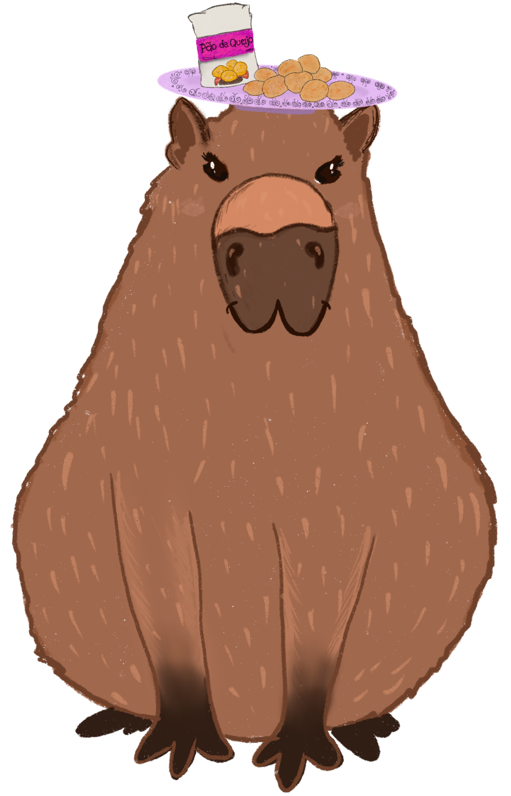

=============================================================================
Tutorial: DQ Robotics with `CoppeliaSim <https://www.coppeliarobotics.com/>`_
=============================================================================
|license| |visitors| |ubuntu| |windows| |mac|
|matlab| |python| |cpp| |coppelia|

.. |license| image:: https://img.shields.io/github/license/dqrobotics/matlab.svg

.. |visitors| image:: https://api.visitorbadge.io/api/visitors?path=https%3A%2F%2Ftutorial-dqrobotics-with-coppeliasim.readthedocs.io%2Fen%2Flatest%2Findex.html%23&countColor=%23ff69b4&style=plastic

.. |windows| image:: https://img.shields.io/badge/limited%20support-Windows-blue

.. |mac| image:: https://img.shields.io/badge/macOS-yellow

.. |ubuntu| image:: https://img.shields.io/badge/official%20support-Ubuntu%20LTS-orange

.. |python| image:: https://img.shields.io/pypi/pyversions/dqrobotics/21.4.0a75

.. |matlab| image:: https://img.shields.io/badge/Matlab-R2022b-green
.. |matlabactivity| image:: https://img.shields.io/github/commit-activity/y/dqrobotics/matlab
.. |matlabtest| image:: https://github.com/dqrobotics/matlab/actions/workflows/matlab_test.yml/badge.svg?branch=master
.. |dqroboticsmatlab| image:: https://img.shields.io/badge/dqrobotics-matlab-green

.. |cpp| image:: https://img.shields.io/badge/C%2B%2B-11-blue
.. |dqroboticscpp| image:: https://github.com/dqrobotics/cpp/actions/workflows/cpp_build_ubuntu.yml/badge.svg?branch=master
.. |coppelia| image:: https://img.shields.io/badge/Tested_on_CoppeliaSim-4.5.1-orange

.. |logo| image:: ../images/logo.svg

.. image:: ../images/cover.png
   :align: center

.. note::

   This project is under active development.

#. :doc:`Preamble: Ubuntu Basics <preamble/about>`
    xxxxxxxxxxxxxxx.

.. toctree::
   :hidden:

   preamble/index
   fundamentals/index
